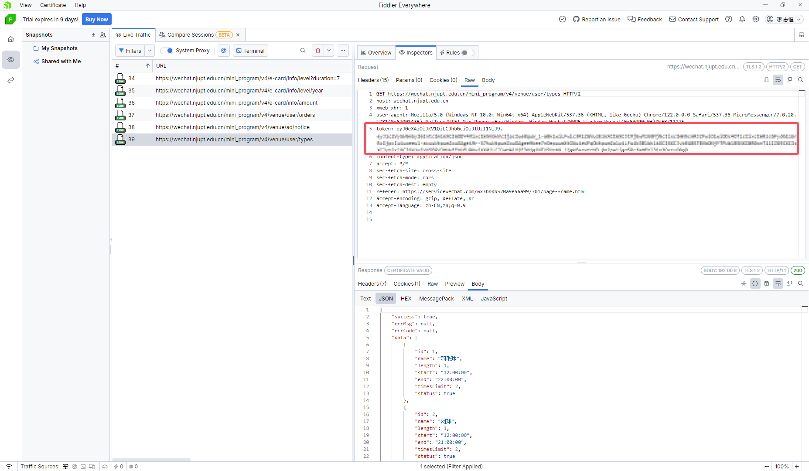

# 南邮小程序自动预约羽毛球场地

复活了，需要自己抓一下token，想全自动需要用wxCode向server端请求但是显然我不会hook微信code，有大哥会可以教教。

要约网球场的话把`get_stadiums_info`函数中的`url`改成

```
f'https://wechat.njupt.edu.cn/mini_program/v4/venue/user/time/2?date={date}'
```

但是应该用不上（

token获取：PC端打开小程序用fiddler抓包，自己学下

[Fiddler4 (telerik.com)](https://www.telerik.com/download/fiddler/fiddler4)



